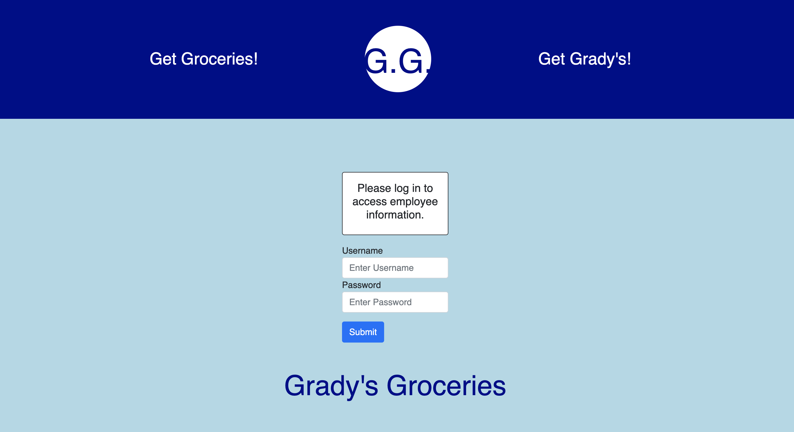
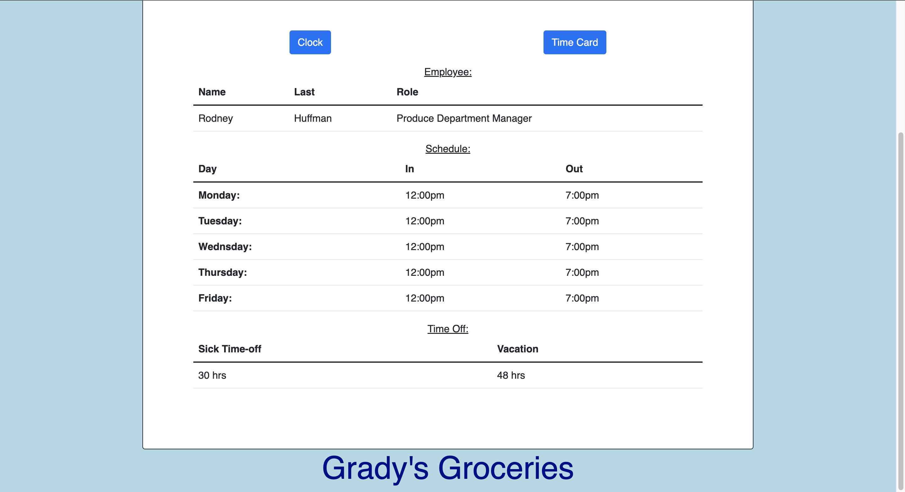
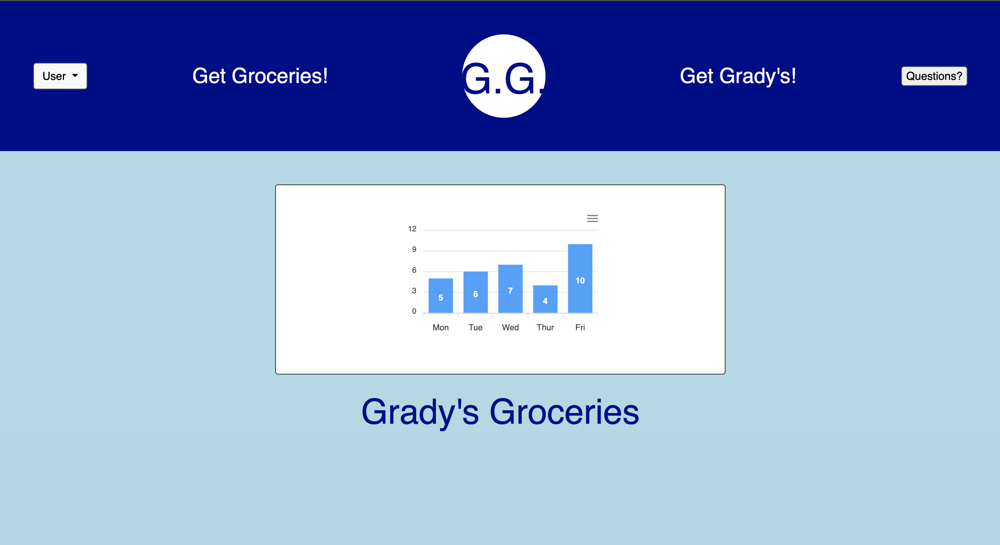
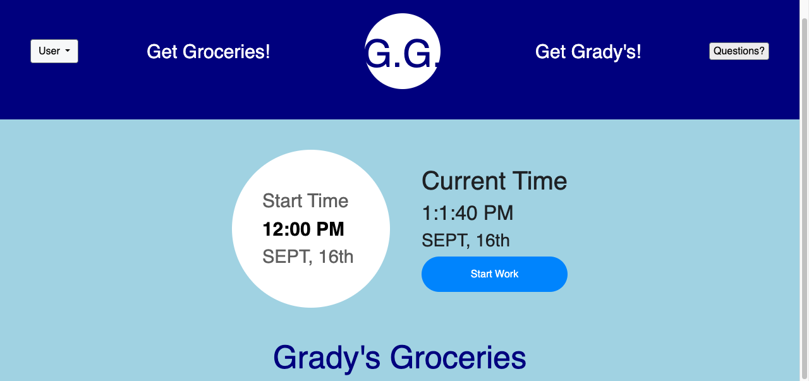
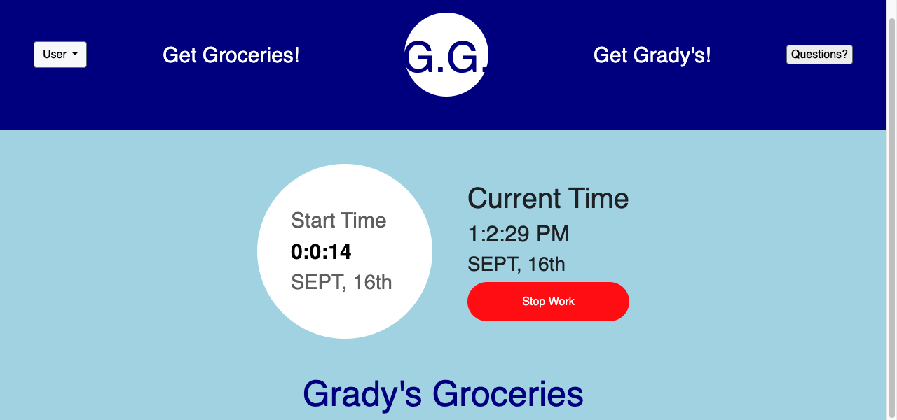

# Grocery-Store-Employee-Management-System

## Description

Businesses and their employees need a way to keep track of employee schedules.  This employee management system for Grady's Groceries allows employees to see their role, shedule for the week, available hours for sick time off and vacation hours.  The employee can also see a graph of hours worked in the previous week, punch in and out for each shift, and submit any questions for management and request time off.  This site uses Handlebars, CSS, JavaScript, Bootstrap, Express, MySql, MySql2, Node, Apexcharts, Sequalize, JawsDb, Heroku, and Bcrypt.

## Tests

To view the site use: 'Username: r.huffman' and 'Password: test123'.

## Usage

Once the user logs in they are brought to their profile page that displays their schedule for the week.  From there the user can click on the 'Clock' button to clock in/out for a shift and click on the 'Time Card' button to view a graph of the previous weeks hours. The user also can click on the 'User' button to log out or view their profile page or click on the 'Questions' button to request time off or submit questions to management.

Screenshots:

The login page is the main page when you go to the website and if your session time expires it will redirect you to this page.

This is the profile page where you can view your schedule, time-off hours, and click on the 'Clock' or 'Time Card' buttons to go to those pages.

The time card displays a graph with the hours worked during the week.

At the clock-in/out page the employees work start time is displayed and the current time.

Once employee clocks in, the clock-in ('Start Work') button changes to the clock-out ('Stop Work') button displayed in red and the start time begins adding up the time until you clock-out to present the amount of time worked during that shift.

If you click on the questions button on the navbar it will direct you to this page where you can either submit a request for time-off or ask management other questions.

Website URL: https://secure-gorge-43395-b510f5266de9.herokuapp.com

GitHub Repository: https://github.com/KKurzawa/Grocery-Store-Employee-Management-System

## CREDITS

There were five collaborators in total displayed below with their Git Hub accounts attached.

Kris Kurzawa: https://github.com/KKurzawa

Bradley Dinnan: https://github.com/bsdinnan

Gage Hamel: https://github.com/GageHamel

Giselle Torres-Villa: https://github.com/gtorresv

Adrian Patton: https://github.com/apatton33

## LICENSE

MIT License

Copyright (c) 2023 Kris Kurzawa

